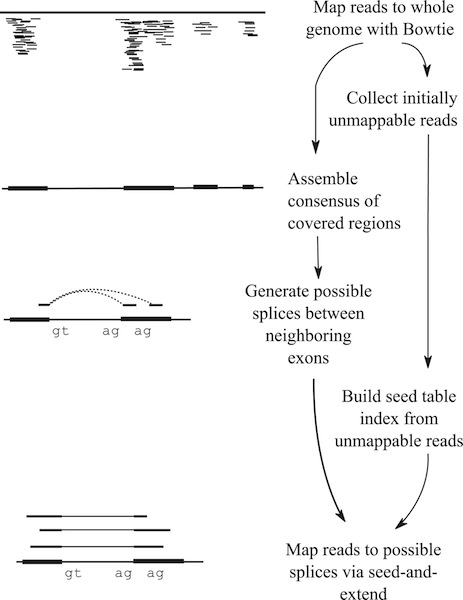
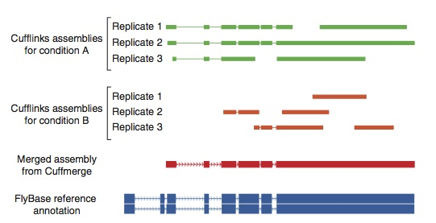
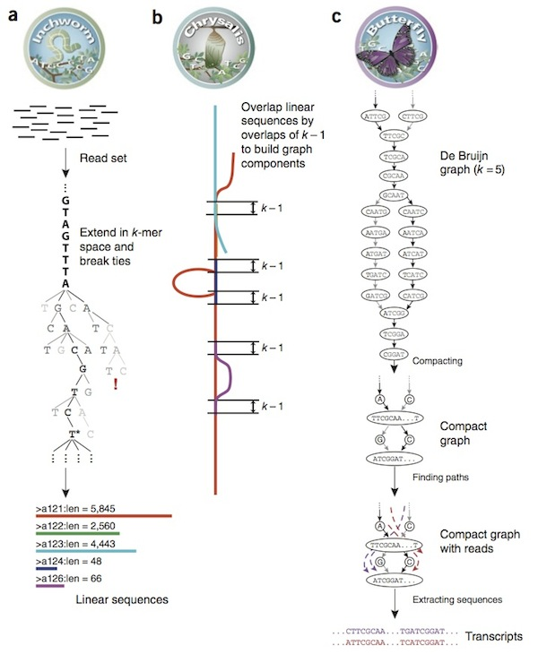

#NGS piplelines

* Quality Control
    * Previous QC from DNA lectures
* Alignment
    * Alignment without splicing (DNA)
    * with splicing (RNA)
* Expression level estimate and comparison
* Tophat and cufflinks in Nature Methods DOI: [10.1038/nprot.2012.016](http://www.nature.com/nprot/journal/v7/n3/full/nprot.2012.016.html)

---
#Alignment with Bowtie and TopHat

[BowTie](http://bowtie-bio.sourceforge.net/)

A fast aligner for short reads. This is comparable to bwa but previous
versions were shown to be less sensitive.

Requires genome file to be indexed just like bwa does.

    $ bowtie-build genome.fa genome
    # or (better to try and use bowtie2 which is faster)
    $ bowtie2-build genome.fa genome

Basis for the alignments used in [TopHat](http://tophat.cbcb.umd.edu/) which supports spliced alignment. 

    $ tophat genome -G genome_annotation.gtf rnaseq_1.fq rnaseq_2.fq
 
---
#mRNA alignment

How to align when the short reads may be interrupted by introns in the genome?
Spliced alignment can be made aware of potential sites

---
#splicing approaches

---
#Cufflinks

For comparing expression values. This will generate table of
expression values per transcript and gene unit.

    $ cufflinks -G genome.gff -I MAX_INTRON_SIZE --library-type [fr-unstranded] tophat/accepted_hits.bam

---
#Denovo annotation with TopHat/Cufflinks

Cufflinks will generate transcript models de-novo from annotation.

---
#Transcript assembly with Trinity

[Trinity](http://trinityrnaseq.sourceforge.net/)

---
#Trinity on biocluster

    $ module load trinity-rnaseq
    $ ulimit -s unlimited
    $ Trinity.pl --max_memory 30G --CPU  20 --kmer_method inchworm \   
      --seqType fq --left Neo_RNA_seq-RNA_l1_1.fq \
      --right Neo_RNA_seq-RNA_l1_2.fq --output trinity_out \
      --jaccard_clip
