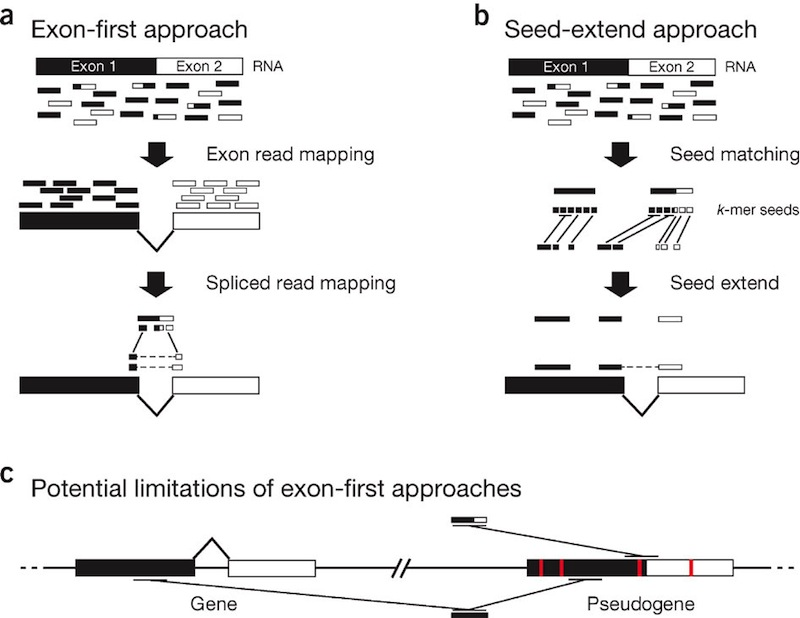

#NGS piplelines

* Quality Control
* Alignment
    * Alignment without splicing (DNA)
    * with splicing (RNA)

---
#BowTie and TopHat

[TopHat](http://tophat.cbcb.umd.edu/)

---
#splicing approaches

---
#Cufflinks

For comparing expression values

---
#Denovo annotation with TopHat/Cufflinks

---
#Other tools
* GSNAP - spliced alignment 

---
#Transcript assembly

Trinity

---
#Statistical significance

