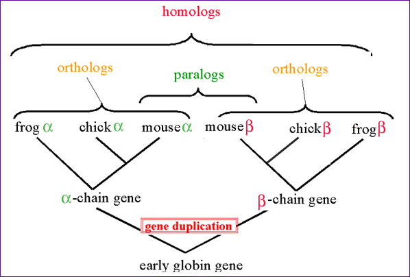
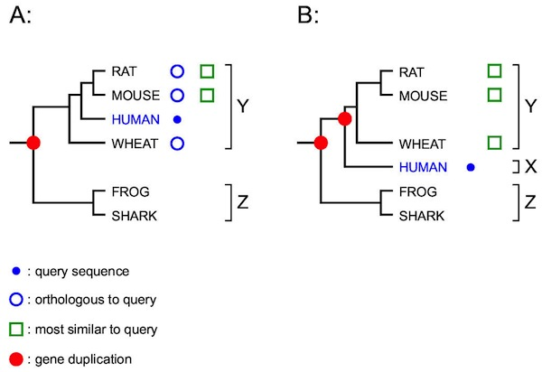
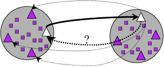
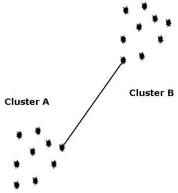

#Comparative genomics

* Studying similarities and differences between genomes of species
* Identifying similar sequences among genomes
* Inferring evolutionary history
* Comparing gene order

---
#Similarity identification

* Sequence alignment approach - see [an animation](http://statgen.ncsu.edu/slse/animations/module1.html).
* [BLAST](http://blast.ncbi.nlm.nih.gov/), [FASTA & SSEARCH](http://fasta.bioch.virginia.edu/fasta_www2/fasta_list2.shtml), [BLAT](http://genome.ucsc.edu/FAQ/FAQblat.html) are tools for sequence similarity identification
* DNA and Protein sequences can be compared and aligned
* However sometimes hard to determine if genes are similar by simple one-way look

---
#Orthologs and Paralogs

---
#Trees can help resolve relationships

Best hits can sometimes be wrong (B) though it can be resolved with phylogenetics.

---
#Reciprocal Searches

* Bi-directional or Reciprocal BLAST

---
#Implement Bidirectional

Method to find best top hit in one direction and the reverse.

Let's walk through the [code](https://github.com/hyphaltip/htbda_perl_class/blob/master/examples/Orthologs/bidirectional.pl)

---
#Clustering

* Lumping genes together based on similarity linkage
* Single-linkage means if there is a link between A-B then they are in a cluster

---
#Code up single-linkage

Let's look at some [code](https://github.com/hyphaltip/htbda_perl_class/blob/master/examples/Orthologs/single_linkage.pl).

---
#Ortholog finding

* Other automated tools include
* OrthoMCL
    * Does Clustering with a tool called MCL (Markov Clustering)
    * Corrects for paralogs

---
#Running OrthoMCL

* Requires use of database (mysql), BLAST, some Perl modules, and the MCL program
* BLAST of all proteomes against each other (one big BLAST run)
* parse output
* Run clustering

---
#Lets run OrthoMCL

See script for running OrthoMCL [here](https://github.com/hyphaltip/htbda_perl_class/blob/master/examples/Orthologs/run_orthomcl.sh).

You will need to modify it slightly to specify a database name that is unique for you
